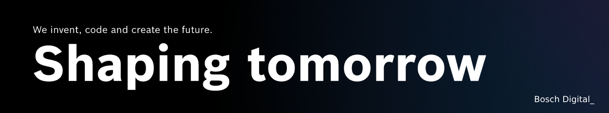

*This service is proudly brought to you by **Bosch Digital Cross-Division Consulting** and **AI Model Serving Platform**.*

## How access completion models?

For this years BCX [Bosch Digital_](https://www.bosch-digital.com/) provides access to these completion models: 

| **OpenAI** | **Llama 2** | **Mistral.ai** |
|------------|-------------|----------------|
| gpt-3.5    | Llama-7b    | Mistral-7b     | 
| gpt-4      | Llama-70b   |                |  


 *All models are provided as chat/instruct variants. For OpenAIs quota limits apply.* 

Using *python* the completion models can be queried in the following way:

```
import requests
import json

url = "https://llms.azurewebsites.net/chat/completions"

payload = json.dumps({
  "model": "MODEL_NAME (SEE TABLE)",
  "temperature": 0.5,
  "messages": [
    {
      "role": "user",
      "content": "YOUR_PROMPT"
    }
  ]
})
headers = {
  'Content-Type': 'application/json',
  'Authorization': 'Bearer YOUR_API_KEY'
}

response = requests.request("POST", url, headers=headers, data=payload)

print(response.text)
```
OR 

```
import openai
client = openai.OpenAI(
    api_key="YOUR_API_KEY",
    base_url="https://llms.azurewebsites.net"
)

response = client.chat.completions.create(model="MODEL_NAME (SEE TABLE)", messages = [
    {
        "role": "user",
        "content": "YOUR_PROMPT"
    }
])

print(response)

```
For OpenAI models, streaming output is also available: 


```
import openai
client = openai.OpenAI(
    api_key="YOUR_API_KEY",
    base_url="https://llms.azurewebsites.net"
)

response = client.chat.completions.create(model="MODEL_NAME (SEE TABLE)", messages = [
    {
        "role": "user",
        "content": "YOUR_PROMPT"
    }
],
stream=True)


for chunk in response:
    if chunk.choices[0].delta.content is not None:
        print(chunk.choices[0].delta.content, end="")
```


## How access embedding models?
... are provided via OpenAI's *text-embedding-3-small*. How to embed your input via *python*?

```

import requests
import json

url = "https://llms.azurewebsites.net/embeddings"

payload = json.dumps({
  "model": "text-embedding-3-small",
  "input": "YOUR_TEXT_TO_EMBED"
})
headers = {
  'Content-Type': 'application/json',
  'Authorization': 'Bearer YOUR_API_KEY'
}

response = requests.request("POST", url, headers=headers, data=payload)

print(response.text)

```
OR

```
from openai import OpenAI

client = openai.OpenAI(
    api_key="YOUR_API_KEY",
    base_url="https://llms.azurewebsites.net"
)

response = client.embeddings.create(
    input="YOUR_TEXT_TO_EMBED",
    model="text-embedding-3-small"
)

print(response.data[0].embedding)
```


## 🚨 Not satisfied, yet? 

>  Function Calling, Whisper, GPT-Vision, custom GPU power for fine tuning or more credits needed —> hit us up via [Slack](https://bcx2024.slack.com/archives/D06JAGN58LX) or visited the Bosch Digital_ Booth at the Marketplace.

-----
